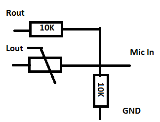

# SoundThermo

Simple thermometer using sound card input and output, a thermistor and couple of resistors.
This version uses Qt framework, so it can be built for different OSes.

# Hardware

One should assemble components as shown on scheme below:

* Lout should be connected to left channel of sound card output
* Rout should be connected to right channel
* Mic In is for microphone input
* GND should be connected to ground (both on input and output)

# Using the software

First, one should compile the project. This can be done via Qt Creator or simply from command line.
For building you will need Qt Core and Qt Multimedia.

Firstly it's useful to run `./soundthermo-cpp list`. This will output all detected sound devices in 
your system, input and output. Note names of desired input and output device.

After that one should run `./soundthermo-cpp measure --input=<INPUT_NAME> --output=<OUTPUT_NAME> --duration=<DURATION>`.
Duration means amount of time spent for measuring (longer the measurement, more precise results). As for me, one second
is enough.

# How it works

The idea is to generate harmonic signal with some amplitude `Vin` on sound output and then measure
`Vout` - amplitude of same signal on microphone input. 

If we consider just left or just right channel, we could not that `Vout = R2 * Vin / (R1 + R2)`,
where `R1` and `R2` are resistor values. Unfortunately, due to different volumes in input and output,
really equation is like `Vout = R2 * Vin * k / (R1 + R2)`. So firstly we do measurement via right 
channel (where we know both `R1` and `R2`), to determine `k`. After that we repeat same measurement
using left channel. Knowing `Vin`, `Vout`, `R2`, and `k` we can determine value of thermistor. 
After that we compute real temperature via approximation formula.

# Notes

For Linux users if you're running this from root user, you will need to have Pulseaudio started 
system-wide. In OpenSuSE this is done via installing package `pulseaudio-system-wide`.